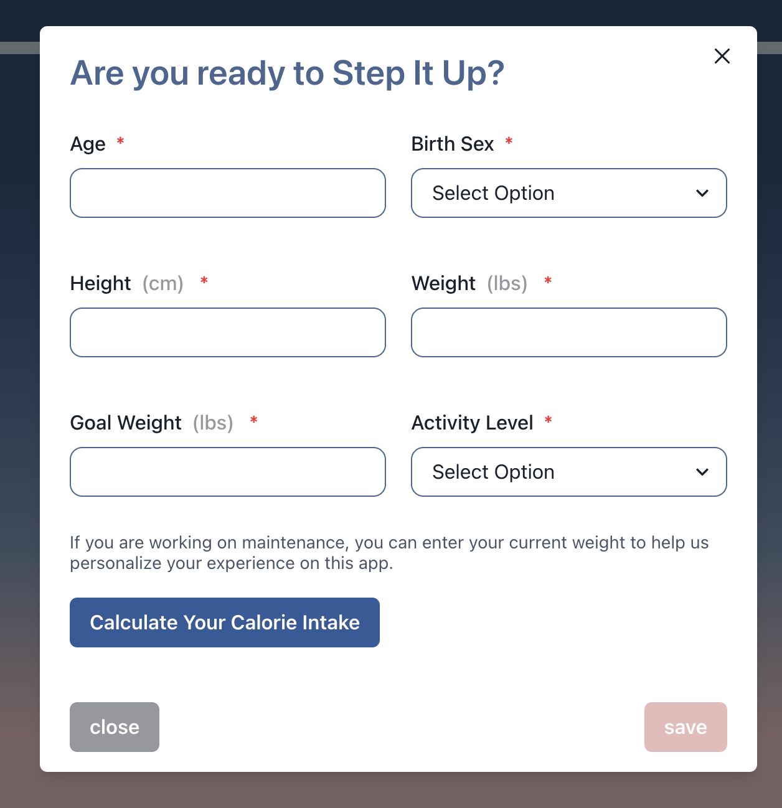
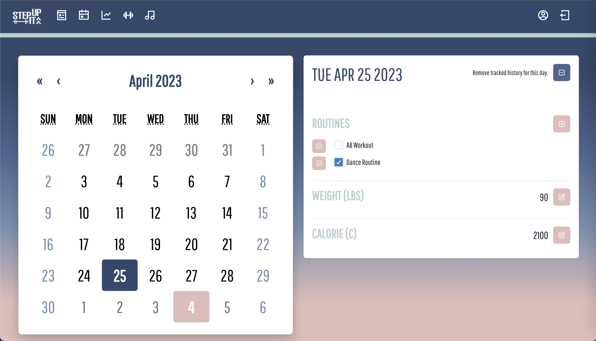
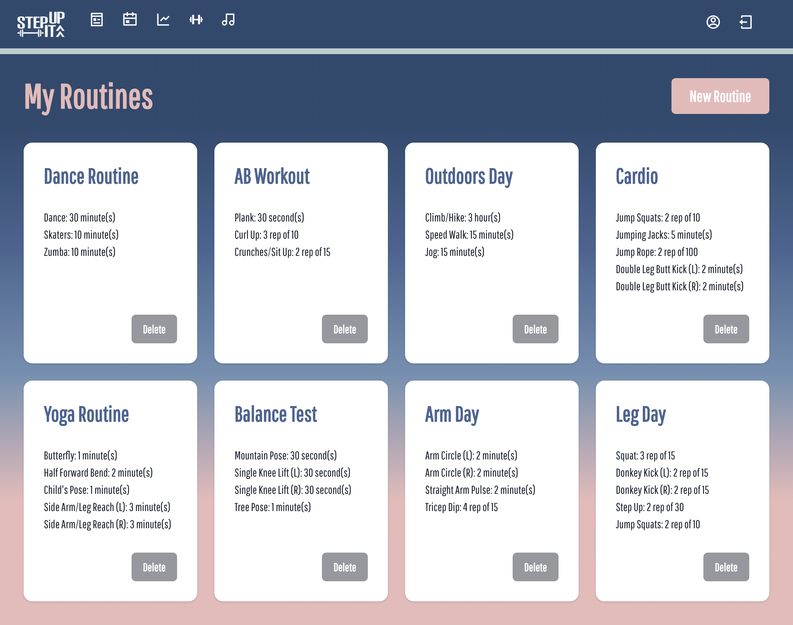

# Project 3 - Workout Hub: Step-It-Up

**Application Link:** [Step-It-Up](https://step-it-up.herokuapp.com)
>**Note**: When creating an account, must have a valid, unique email and password must be at least 5 characters in length

**View:** [Table of Content](#table-of-content) / [Creator Notes](#creator-notes) / [Application Pages Preview](#application-pages-preview)

**Application Preview:**


---

## **TABLE OF CONTENT**

* [Descripton](#description)

* [Installation Instructions](#installation-instructions)

* [Usage Information](#usage-information)

* [App License](#app-license)

* [Contribution Guidelines](#contribution-guidelines)

* [Questions](#questions)

* [API Attributions](#api-attributions)

---

## Description

> *Step-It-Up* is a site designed to let users keep track of their fitness goals and share them with friends. With the application, you can create a profile to moniter your activity, track calories and workouts with an easy-to-use calendar, and blog about your fitness journey to friends
   
> User accounts and data are stored so that a user can access, update, and add to their routines and calendar.
>
> The site's interface is fun and interactive so users can enjoy the process of viewing and creating routines and fitness plans.
>
> Users can browse existing blog posts and add comments and likes to content of interest, as well as create their own
>
> Users can create routines and spotify playlists, to help accompany their excercise program
>
> Users can use the tracker page to see all their key stats, such as routines, calories, and weight

---

## Installation Instructions 

> To run locally, simply use 'npm install', then 'npm run develop'. Otherwise, access/view live on Heroku at - [Step-It-Up](https://step-it-up.herokuapp.com/).

---

## Usage Information 

> To start, head to the URL provided above. 
>
> Next, head to "Login / Sign up" and create a new account or sign into your existing one.
>
> From there, start viewing and liking posts, adding routines and playlists, and checking your info in the calendar and tracker!

---

## App License 

> This app is covered under the following license: None

---

## Contribution Guidelines 

> Application not accepting direct contribution.
> However, any feedback is welcomed to be sent to the contacts below.

---

## Questions 

> For more information and questions, please contact any of the team members below:
> * <analise.giobbi@gc.com> [(GitHub)](https://github.com/analisegiobbi3)
> * <fannychen623@gmail.com> [(GitHub)](https://github.com/fannychen623)
> * <BenSDecker@gmail.com> [(GitHub)](https://github.com/benjiCCB)
> * <manchandasavita3@gmail.com> [(GitHub)](https://github.com/savitamanchanda)
> * <jonathanortiz1007@gmail.com> [(GitHub)](https://github.com/jonytoast)

## API Attributions
> [SPOTIFY](https://developer.spotify.com/documentation/web-api)

---

## **CREATOR NOTES**

### **Our Task**
* Create the application from scratch. 

* Use React and Chakra.js as a template engine.
   > CSS Framework Used: [Chakra.js](https://chakra-ui.com/)
   > Have polished and responsive UI.

* Get API keys and connect to a server-side API.
   > API Used: [SPOTIFY](https://developer.spotify.com/documentation/web-api/reference/get-track)

* Use Node.js and Express.js to create a RESTful API.

* Include authentication (express-session, cookies, JWT).
   > Used bycrypt to protect user data.

* Use GraphQL, MongoDB, and Mongoose for our database.
   > Connect to server and use typedefs and resolvers to perform CRUD Operations.

* Use dotenv to protect API keys and sensitive information with environment variables

* Use Apollo Client and Server to create dynamic front-end / back-end integration.

* Organize folder structure to meet Client-Server paradigm. 


## User Story
```
AS an excercise enthusiast
I WANT to have a place to read and like posts about fitness 
I WANT to be able to create excercise routines for myself, and pick out matching Spotify playlists
I WANT to have a centralized tracker area when I can monitor my fitness goals and progress 
```
## Acceptance Criteria
```
GIVEN a fitness tracking application 
WHEN I create a profile
THEN I can log in with that profile and see all of my progress
WHEN I click on the calendar tab
THEN I have access to a calendar where I can track my calories and routines
WHEN I click on the routine tab
THEN I can input the routines I want to follow
WHEN I click on the blog tab
THEN I can blog about my progress, see others' blog posts, and like or comment on content of interest
WHEN I click on the playlists section
THEN I am given the opportunity to find matching musical playlists to accompany my workout


```

## Package Information
* Engines:
   * [node](https://nodejs.org/en/), version 16.19.0
* Dependencies: 
   * [apollo-server](https://www.npmjs.com/package/@apollo/server), version ^3.6.2
   * [apollo/client](https://www.npmjs.com/package/@apollo/client), version ^3.7.12
   * [bcrypt](https://www.npmjs.com/package/bcrypt), version ^5.0.0
   * [chakra-ui](https://www.npmjs.com/package/@chakra-ui/react) version ^2.5.5
   * [chart.js](https://www.npmjs.com/package/chart.js), version ^4.2.1,
   * [dotenv](https://www.npmjs.com/package/dotenv), version ^8.2.0
   * [express](https://www.npmjs.com/package/express), version ^4.17.1
   * [express-session](https://www.npmjs.com/package/express), version ^1.17.1
   * [graphql](https://www.npmjs.com/package/graphql), version ^16.3.0
   * [jwt-decode](https://www.npmjs.com/package/jwt-decode), version ^3.1.2
   * [mongoose](https://www.npmjs.com/package/mongoose), version ^6.9.2
   * [react](https://www.npmjs.com/package/react), ^18.2.0

--- 

## **APPLICATION PAGES PREVIEW**
### Landing Page
>
### Login / Sign Up Modal
>
### User Dashboard
>
### User Profile
>
### Blog Home
>
### Commenting Functionality
>
### New Post Form
>
### Calendar
>
### New Routine 1
>
### New Routine 2
>
### My Routines
>
### Tracker
>
### My PLaylists
>
